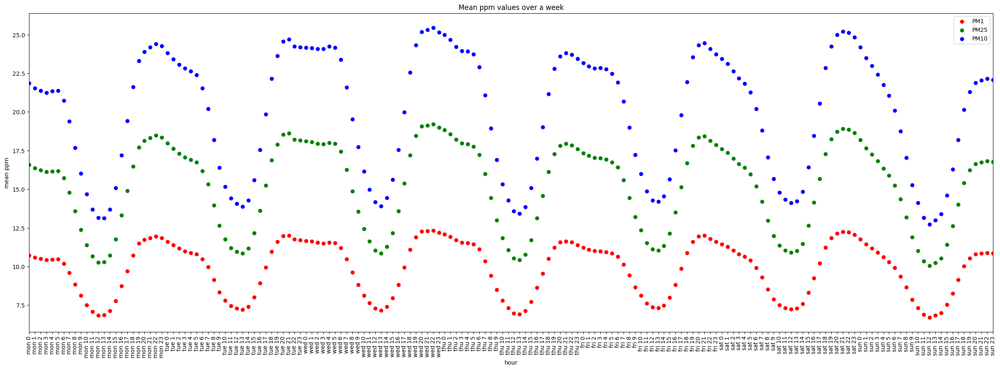

# Air Quality in Cracow
Scripts downloading air quality data from [Airly](https://developer.airly.org/en).

## Usage
1. Create file `Airly_API.json` containing your Airly API key(s) in a json array (eg. `[ "<API key>" ]`)
2. Save list of sensors to query in `sensors_list.json` (as a JSON list of objects with at least `'id'` field)
3. Run `python get_measurements.py` to download and save current measurmenets
4. Run `python plot_charts.py` to plot all charts and animations, or `python plot_charts.py <arg> [<args>]` to plot only selected charts.

## Example animation

## Example chart

## Flat Github
View measurement data on [flatgithub.com/PKopel/AirQual](https://flatgithub.com/PKopel/AirQual)